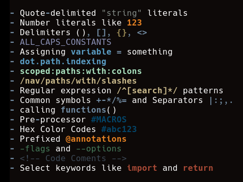

vim-syntacky
============

Universal and Language-agnostic Syntax Definitions

Motivation
----------

Are you tired of opening files with weird extensions to find there's no syntax
highlighting? Or over-ambitious syntax plugins that are slow, CPU-intensive and
ultimately don't work very well? Well now you can have one universal syntax
plugin that's less ambitious and doesn't work very well!

Philosophy
----------

Instead of trying to accurately define all the awkward syntax patterns of a
specific language, Syntacky aims to only provide syntax patterns that are easy
to define and appear ubiquitously across many languages. Here's a screenshot
with some examples:

By avoiding nested or overly complex syntax definitions the hope is that
highlighting will remain performant and consistent. However, if you care more
that language syntax is represented accurately this may not be the plugin
for you. The aim is to apply some minimal highlighting to any file, using
basic elements from your existing colorscheme, but not strictly following
any conventions on how those colors are applied.

Licensing
---------

Copyright 2022 Brian Dellaterra. Licensed under the EUPL version 1.2

